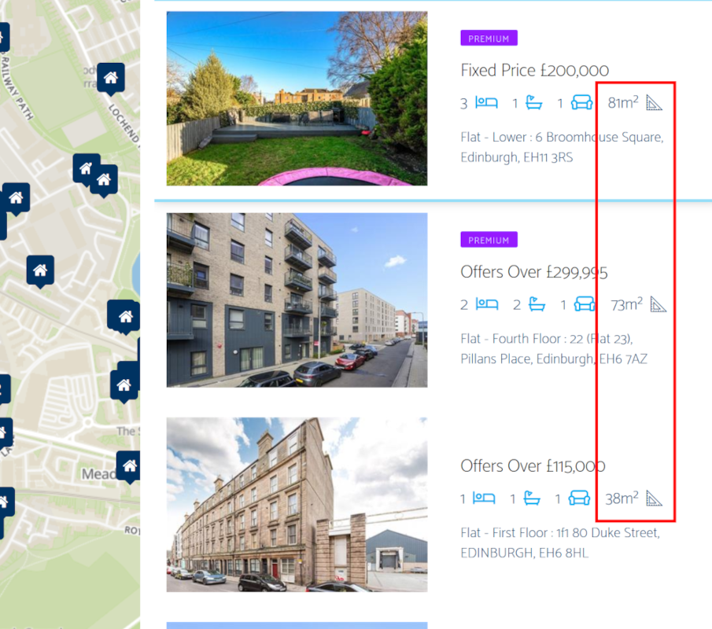

# ESPC Floor Area

A browser extension that displays the floor area of properties when viewing search results.
The floor area is displayed next to the number of rooms, and appears in list view, map view and grid view.  See below for an example:


Install for Firefox here: https://addons.mozilla.org/en-US/firefox/addon/espc-floor-area
Install for Chrome here: https://chromewebstore.google.com/detail/espc-floor-area/adpepflbapaamklldebghgeohhdanfdh

## Building

Ensure you have the web-ext tool installed:
```npm install --global web-ext```

Run build.sh:
```./build.sh```

This will create the `build/firefox` and `build/chrome` directories.
These can be loaded into firefox or chrome locally using `manifest.json` from the corresponding directory.
Each will also contain an `artifacts` directory with the extension packaged in a .zip file.

## Credit
Extension icon provided by [BomSymbols - Flaticon](https://www.flaticon.com/free-icons/ui-design)
